# Toko Elektronik

# Fitur Website Toko Elektronik
Website Toko Elektronik berbasis Laravel ini memiliki berbagai fitur yang membantu proses penjualan produk elektronik secara online. Sistem dibuat agar memudahkan user dalam melakukan pembeli produk dan memudahkan admin dalam mengelola data toko.

# Kelebihan Website
Website Toko Elektronik berbasis Laravel ini memiliki beberapa kelebihan, yaitu memudahkan user dalam membeli produk secara online tanpa harus datang ke toko, proses transaksi menjadi lebih cepat dan praktis, serta data tersimpan otomatis di database sehingga lebih aman dan terorganisir. Selain itu, admin juga lebih mudah dalam mengelola produk, kategori, dan pesanan melalui dashboard. Website ini juga sudah responsive sehingga bisa diakses di berbagai perangkat, serta menggunakan Laravel yang membuat sistem lebih rapi, aman, dan mudah dikembangkan kembali di masa depan.

---

## Screenshot Halaman user

### 1. Login User
Halaman ini digunakan user untuk masuk ke sistem menggunakan email dan 
password yang sudah terdaftar.

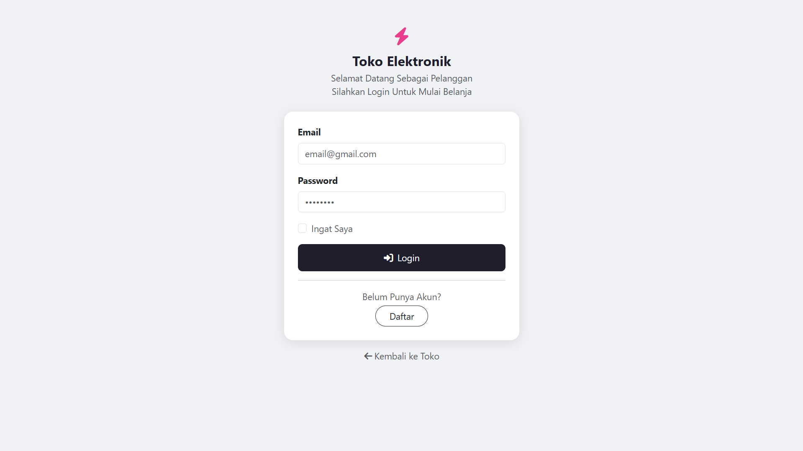

### 2. Register
Halaman ini digunakan untuk membuat akun baru sebelum user dapat
login ke dalam sistem.

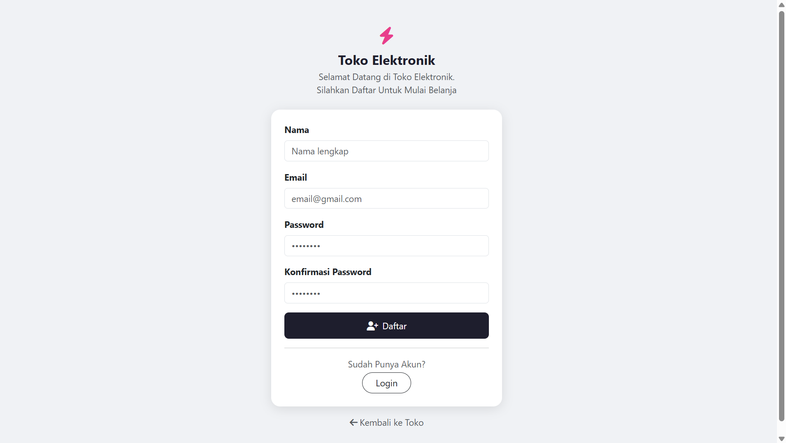

### 3. Halaman Shop
Halaman ini menampilkan semua produk elektronik yang tersedia 
di toko lengkap dengan gambar, nama produk, dan harga.

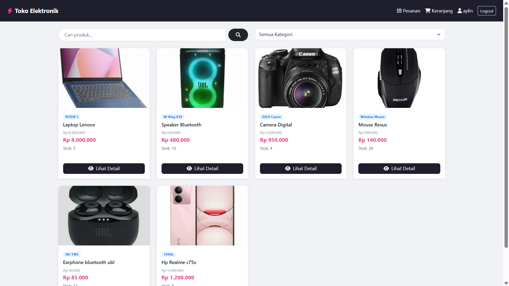

### 4. Detail Produk
Halaman ini menampilkan informasi lengkap dari produk yang dipilih
seperti deskripsi, harga, dan gambar produk.

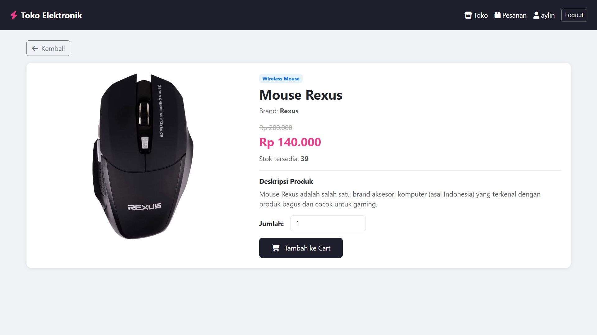

### 5. Cart
Halaman ini digunakan untuk menampilkan produk yang sudah ditambahkan
ke keranjang sebelum melakukan checkout.

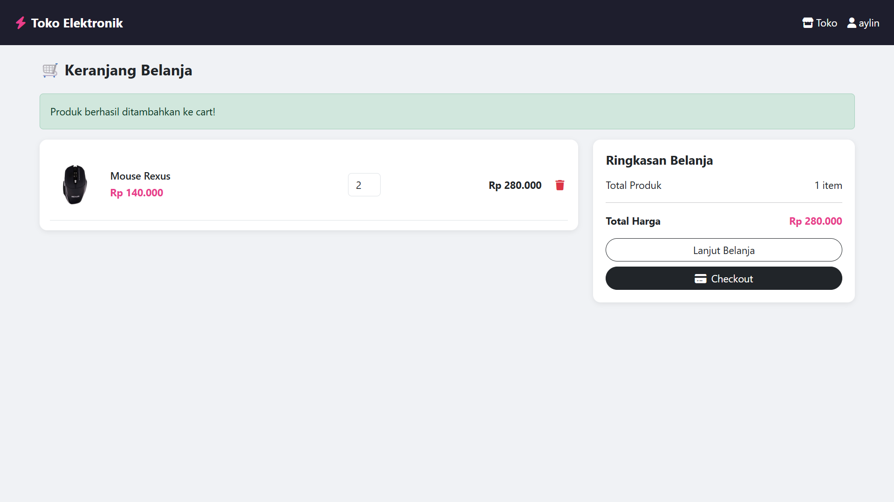

### 6. Checkout
Halaman ini digunakan untuk menyelesaikan proses pembelian dengan mengisi data pemesanan dan konfirmasi transaksi.

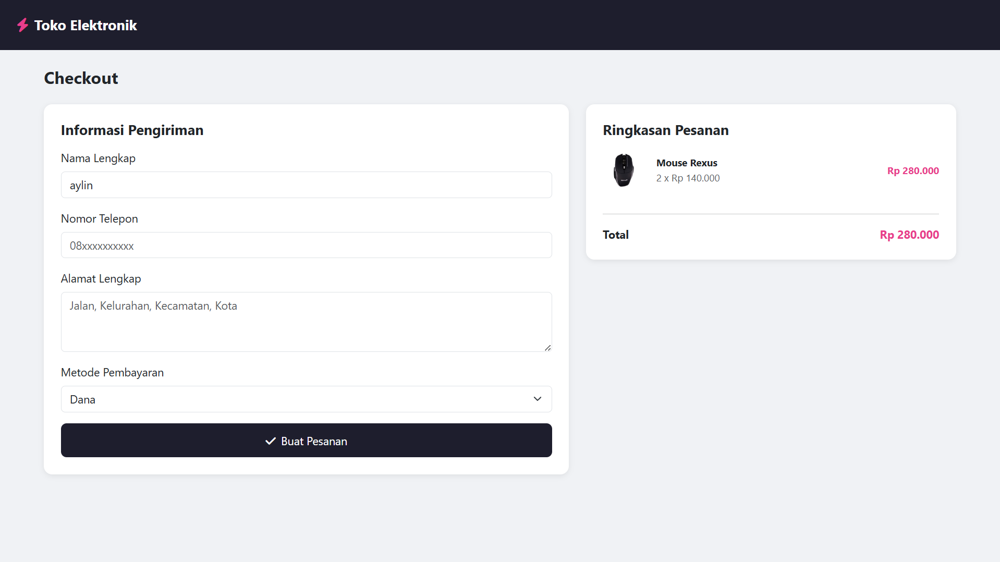

### 7. Riwayat Pesanan
Halaman ini menampilkan semua riwayat pesanan yang pernah dilakukan oleh
user beserta statusnya.

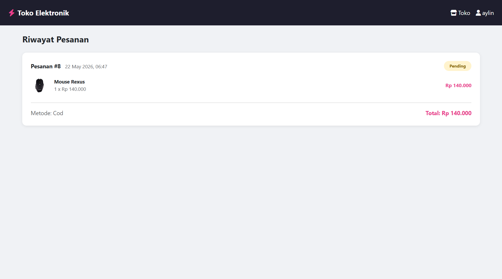

## Screenshot Halaman Admin

### 8. Login Admin
Halaman ini digunakan admin untuk masuk ke dashboard admin.

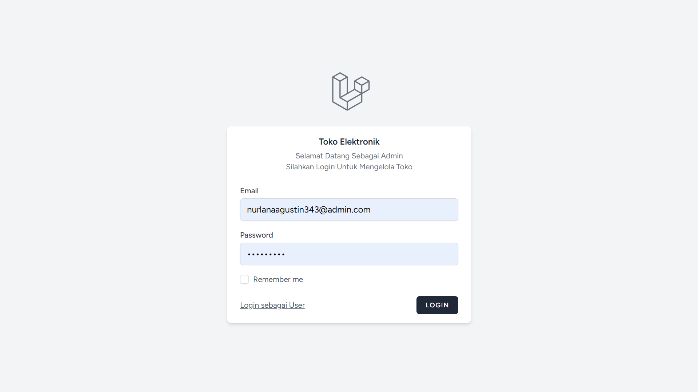

### 9. Dashboard Admin
Halaman utama admin yang menampilkan ringkasan data seperti jumlah produk,
kategori, dan pesanan.

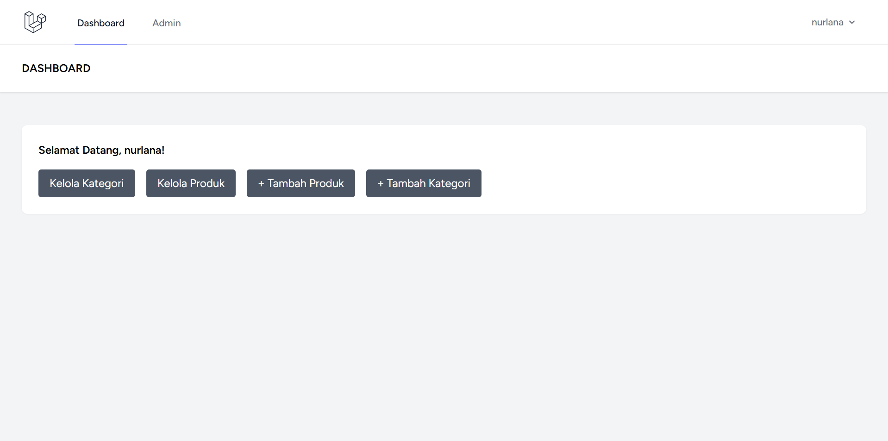

### 10. Kategori Admin
Halaman ini digunakan admin untuk mengelola kategori produk seperti
menambah, mengedit, dan menghapus kategori.

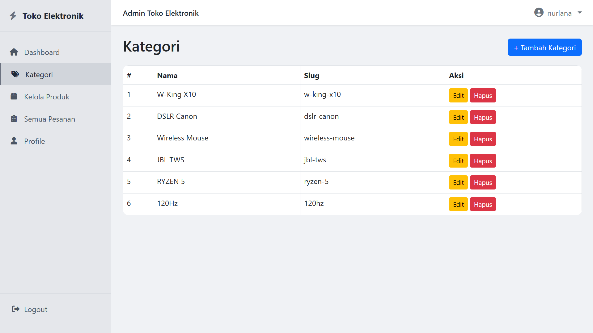

### 11. Kelola Produk Admin
Halaman ini digunakan admin untuk mengelola data produk seperti
menambah, menguba, dan menghapus produk.

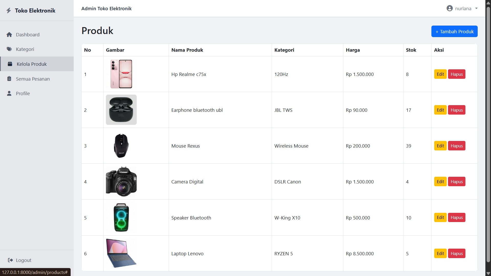

### 12. Semua Pesanan Admin
Halaman ini menampilkan seluruh pesenan yang masuk dari user dan digunakan
admin untuk memantau transaksi.

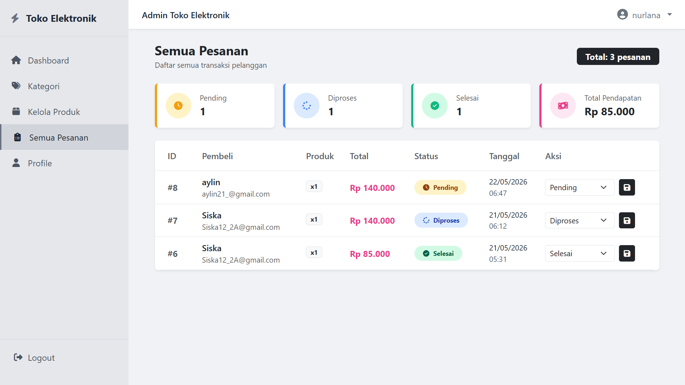

---

## Screenshot Database

### Tabel Users
Menyimpan data akun user dan admin.
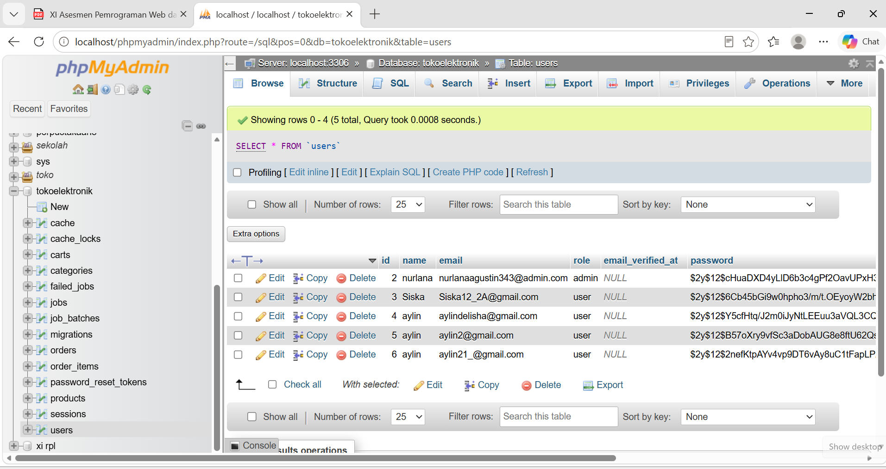

### Tabel Products
menyimpan data produk elektronik yang dijual di sistem.
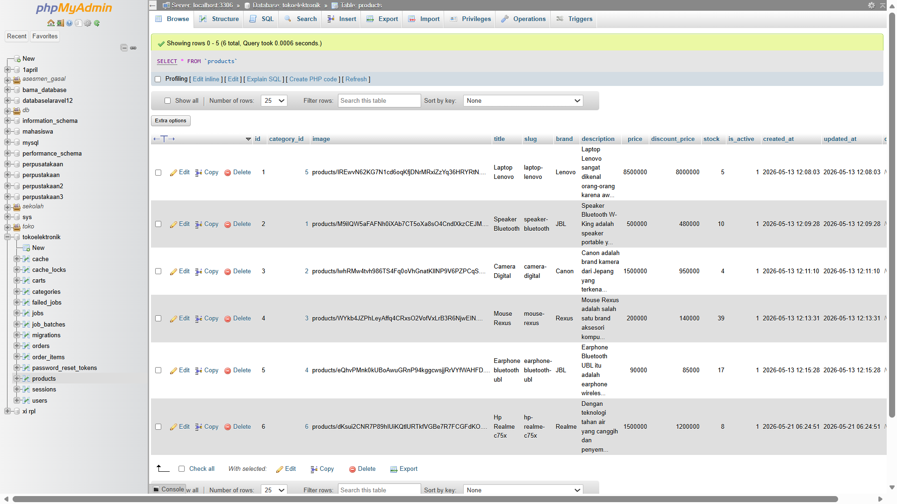

### Tabel Categories
menyimpan data kategori produk.
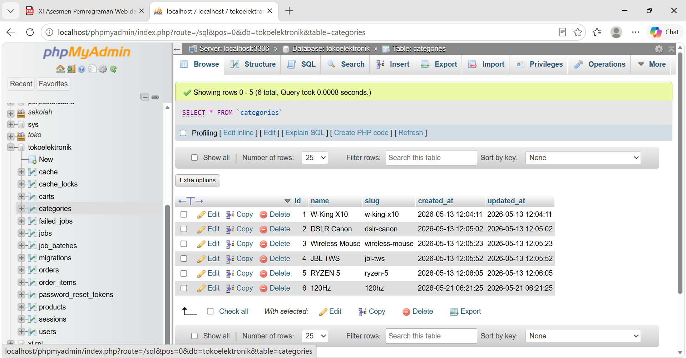

### Tabel Orders
menyimpan data transaksi atau pesenan dari user.
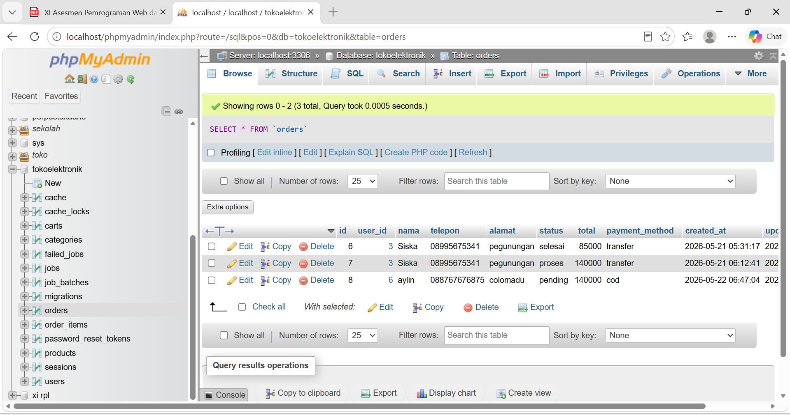

### Tabel Order Items
menyimpan detail produk dalam setiap transaksi pesanan.
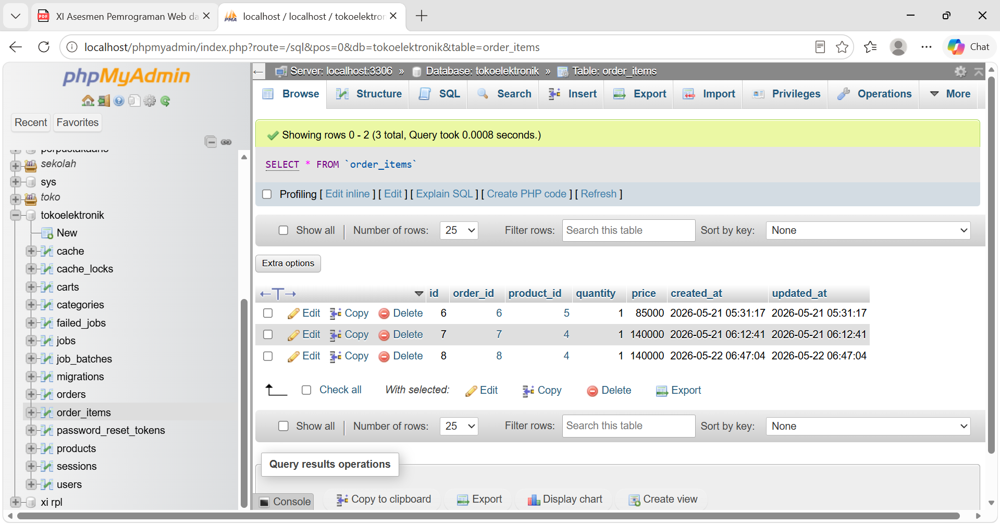

### Tabel Carts
menyimpan data produk yang ada di keranjang user sebelum checkout.
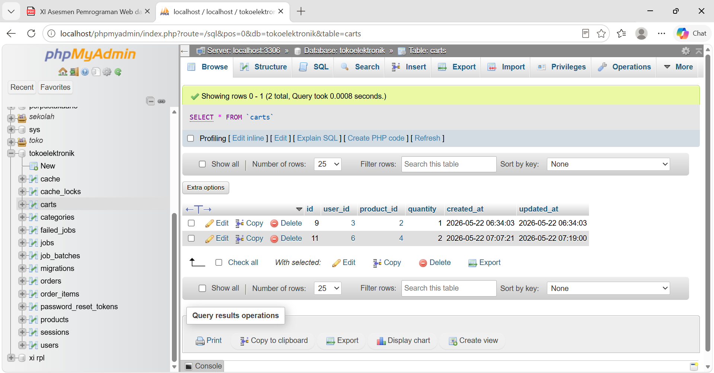

# Kesimpulan
Website Toko Elektronik berbasis Laravel ini dibuat untuk mempermudah proses penjualan produk elektronik secara online agar lebih cepat, praktis, dan efisien. Dengan adanya sistem ini, user dapat dengan mudah melihat produk, mencari barang, melihat detail produk, menambahkan ke keranjang, hingga melakukan checkout tanpa harus datang langsung ke toko. Selain itu, user juga dapat melihat riwayat pesanan sehingga setiap transaksi dapat dipantau dengan lebih jelas. Di sisi lain, admin juga sangat terbantu karena seluruh pengelolaan data dilakukan melalui sistem. Admin dapat mengelola produk, kategori, serta memantau semua pesanan user dengan lebih mudah melalui dashboard. Hal ini membuat proses pengelolaan toko menjadi lebih terstruktur dan tidak lagi dilakukan secara manual. Secara keseluruhan, sistem ini memberikan solusi yang lebih modern dalam proses jual beli produk elektronik. Dengan menggunakan Laravel dan database MySQL, website ini menjadi lebih aman, rapi, dan mudah dikembangkan kembali di masa depan jika diperlukan penambahan fitur baru.
